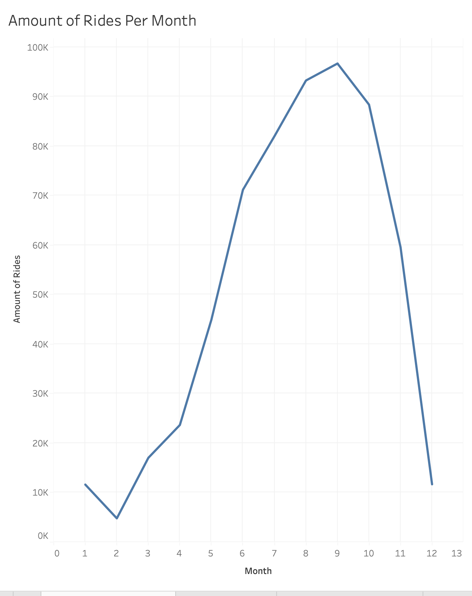
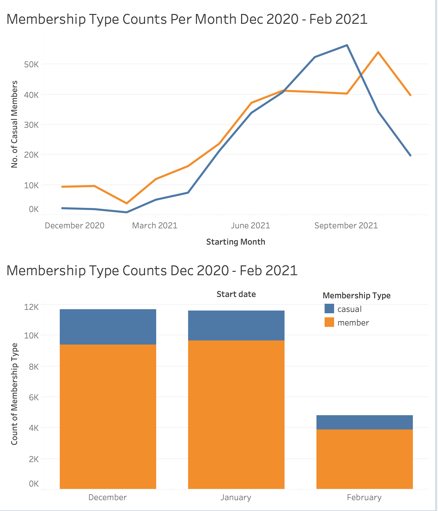
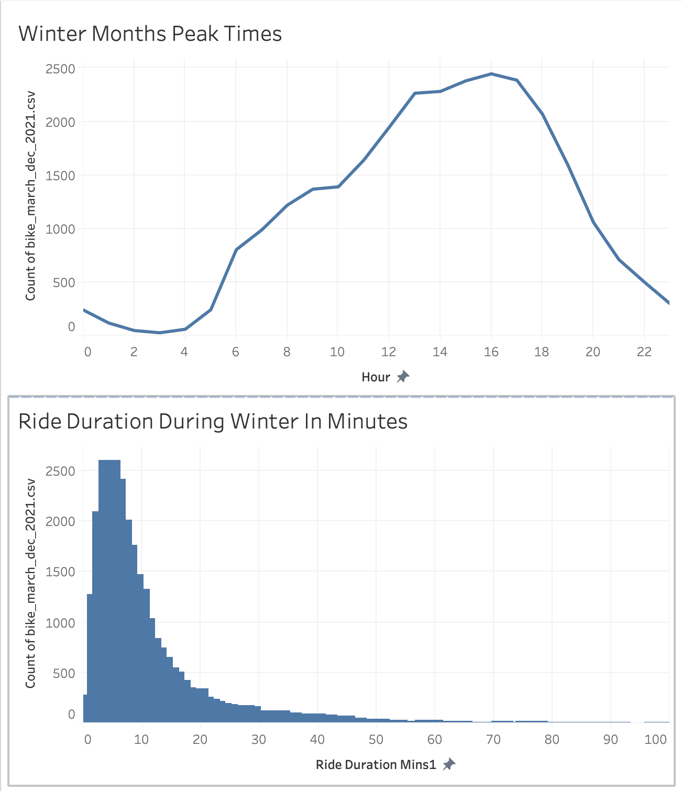
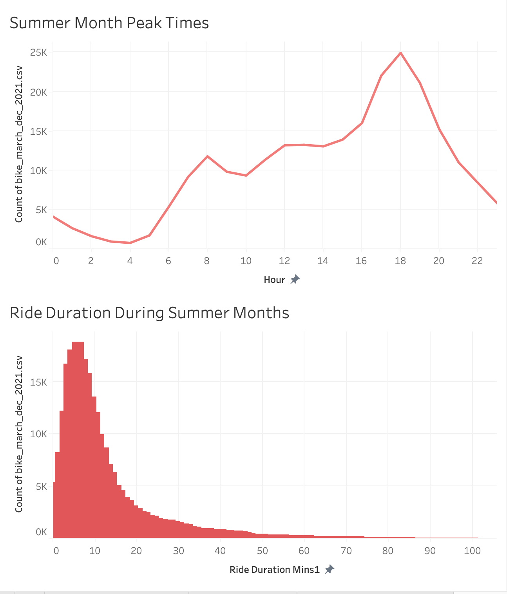
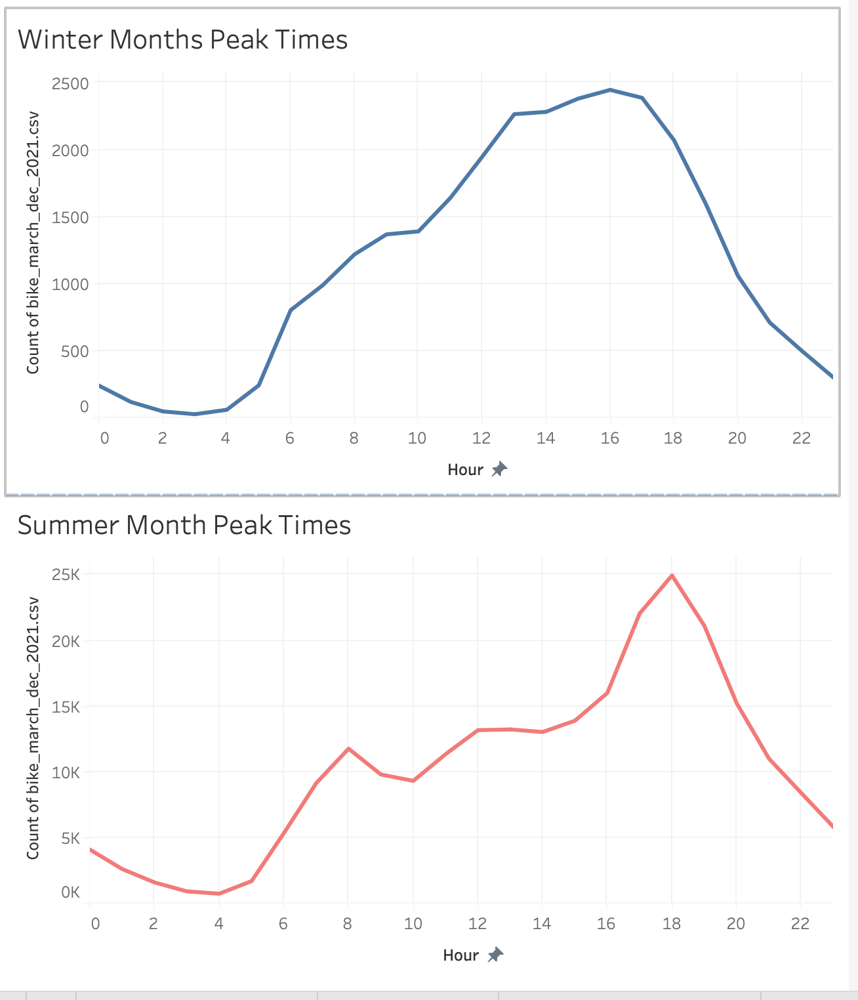
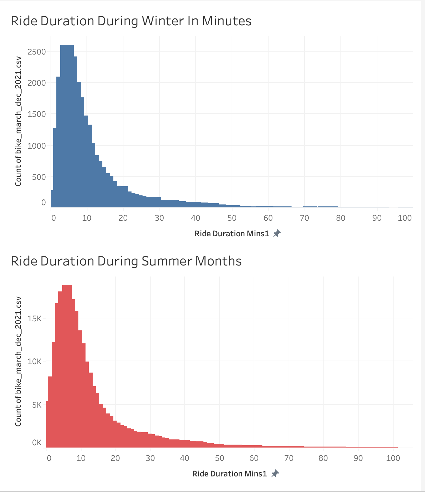
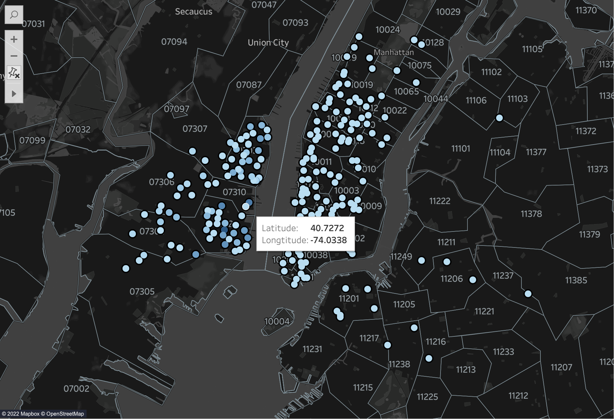

# Citi_Bike
**You can find the Analysis Here: https://public.tableau.com/app/profile/marcus5817/viz/CitiBike_16412580222470/Story1**

**The analysis can be found in the [here](Citi_Bike_Analysis.md).**

## **Summary**:
## Background

Congratulations on your new job! As the new lead analyst for the [New York Citi Bike](https://en.wikipedia.org/wiki/Citi_Bike) Program, you are now responsible for overseeing the largest bike sharing program in the United States. In your new role, you will be expected to generate regular reports for city officials looking to publicise and improve the city program.

Since 2013, the Citi Bike Program has implemented a robust infrastructure for collecting data on the program's utilisation. Through the team's efforts, each month bike data is collected, organised, and made public on the [Citi Bike Data](https://www.citibikenyc.com/system-data) webpage.

However, while the data has been regularly updated, the team has yet to implement a dashboard or sophisticated reporting process. City officials have a number of questions on the program, so your first task on the job is to build a set of data reports to provide the answers.

## Task

**Your task in this assignment is to aggregate the data found in the Citi Bike Trip History Logs and find two unexpected phenomena.**

* Use your visualisations (does not have to be all of them) to design a dashboard for each phenomena.
* The dashboards should be accompanied with an analysis explaining why the phenomena may be occurring.

* A static map that plots all bike stations with a visual indication of the most popular locations to start and end a journey with zip code data overlaid on top.

## **Tools used**:
- Tableau
- Python

## **Python Packages Used**:
- Pandas
- Os
- Numpy
- Glob
- Datetime

## **Screenshots**
**Amount of Rides Per Month**

**Membership Types**

**Winter Months**

**Summer Months**

**Peak Comparison**

**Duration Comparison**

**Map**

## **Running the jupyter notebooks**
1. Before running any of the jupyter notebooks please install needed packages running the following code in the terminal.
         
        pip install pandas
        pip install glob
        pip install os
        pip install datetime
        pip install numpy
Or run this code in the first Jupyter Notebook

        ! pip install --user pandas
        ! pip install --user glob
        ! pip install --user os
        ! pip install --user numpy
        ! pip install --user datetime

2. Unzip the folder Data.zip
   
3. Run the file *Cleaning_Jan_Feb.ipynb* 

4. Run the file *data_cleaning.ipynb* 
